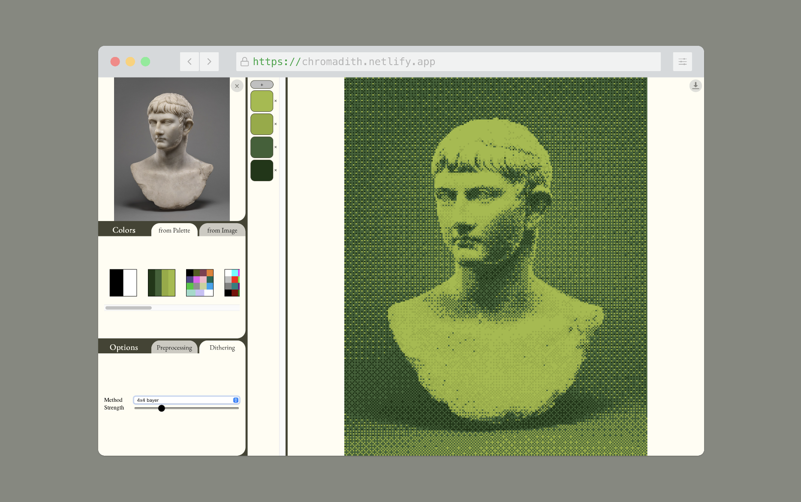

# Chromadith

**Chromadith** is a browser-based image processing tool that transforms images into stylized dithering artworks using custom color palettes. Ideal for digital artists, retro computing fans, and pixel art enthusiasts. **[LIVE DEMO](http://chromadith.netlify.app)**

## Features

- 🎨 **Color Palette Selection**  
  - Choose from predefined palettes or extract colors directly from your image using quantization (k-means or median-cut).
  
- 🧪 **Image Preprocessing**  
  - Adjust exposure and contrast.
  - Set output image size.

- 🖼️ **Dithering Methods**  
  - Choose from various dithering techniques including:
    - Threshold
    - Error Diffusion (Floyd-Steinberg, Atkinson, Jarvis-Judice-Ninke, Stucki, Shiau-Fan)
    - Ordered Bayer (2x2, 4x4, 8x8)
    - Random and Blue Noise

- 🔄 **Live Preview**  
  - See the dithered result update in real time.

- ⬇️ **Download Output**  
  - Export the processed image directly as PNG.

## Usage

1. **Open the application in a desktop browser.** *(Mobile not supported yet)*
2. **Upload an image** via drag & drop or file selector.
3. **Choose a color palette** or extract one from the image.
4. **Adjust preprocessing settings** (exposure, contrast, size).
5. **Select a dithering method** and optionally tweak its strength.
6. **Download your final image.**

## Setup

Simply open `index.html` in any modern browser.

Dependencies:
- Local files: `edith.css`, `edith.js`
- Google Fonts: EB Garamond

## Notes

- Designed for desktop use.
- Color palette management and dithering are performed client-side, all the data stays on your system!
- Based on the HTML5 File API and Canvas.

## License

MIT License

---

Created with ❤️ for art and code.
